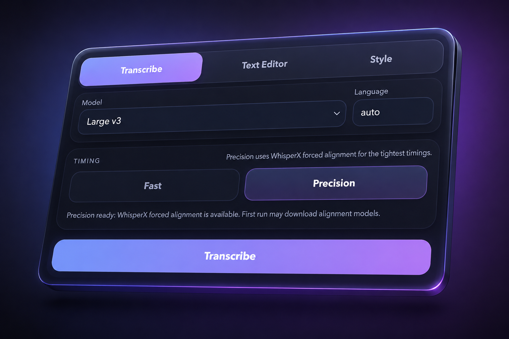

# Captions v03

Captions v03 is an After Effects CEP panel for creating editable subtitles with local Whisper transcription.



## Features

- Local transcription through `whisper-cli`.
- Precision mode through WhisperX forced alignment.
- One, two, three, custom, sentence, and smart split modes.
- Manual transcript editor before burning text into After Effects.
- Native editable AE text layers.
- Built-in visual caption style presets.
- Optional separated JSON export for ReelScript workflows.

## Quick start

1. Download `CaptionsV03-mac.zip` from the latest release.
2. Unzip the file.
3. Double-click `install.command`.
4. Wait for the installer to finish. The first install can take a while because it may install `ffmpeg`, `whisper-cpp`, and download the Whisper model.
5. Restart After Effects.
6. Open `Window > Extensions > Captions v03`.
7. Make sure the panel says `Helper ready`.

## Install on macOS

Download `CaptionsV03-mac.zip` from the latest release, unzip it, then run:

```bash
./install.command
```

The installer copies the panel to:

```text
~/Library/Application Support/Adobe/CEP/extensions/CaptionsV03
```

It installs the helper service at:

```text
~/Library/Application Support/Captions/bin/captions-helper
```

The first install can take a while. It may install Homebrew packages and download the default Whisper model.

## What the installer prepares

- `ffmpeg`, if missing and Homebrew is available.
- `whisper-cli`, through Homebrew `whisper-cpp`, if missing.
- A default `large-v3` whisper.cpp model in:

```text
~/Library/Application Support/Captions/models
```

- A launch agent named `com.ivan.captions-helper`.
- CEP debug mode for local unsigned panels.

## How to use

1. Open your After Effects project.
2. Add or select the footage/audio you want to subtitle.
3. Open `Window > Extensions > Captions v03`.
4. In the `Transcribe` tab, choose the model and language.
   - `auto` lets Whisper detect the language.
   - `Large v3` gives better quality but takes longer.
5. Choose timing mode:
   - `Fast` is quicker and works with the default local Whisper setup.
   - `Precision` uses WhisperX forced alignment for tighter timing when the precision backend is installed.
6. Click `Transcribe`.
7. Review and adjust the text in the `Text Editor` tab.
8. Pick a preset or adjust the look in the `Style` tab.
9. Click `Burn Text` to create editable text layers in After Effects.


## Troubleshooting

- If the panel does not say `Helper ready`, run `install.command` again and restart After Effects.
- If transcription is slow, try a smaller model or use `Fast` timing.
- If `Precision` is not available, install the precision backend below.
- If macOS blocks the installer, right-click `install.command` and choose `Open`.

## Precision mode

Precision mode uses WhisperX. To install the precision backend after the main install:

```bash
bash installer/setup_precision_backend.sh
```

Then restart the helper service or run the installer again.

## Build from source

```bash
bash installer/build_helper.sh
bash installer/install_v03_macos.sh
```

## Package a release

```bash
npm run check
npm run package
```

The release zip is created at:

```text
releases/CaptionsV03-mac.zip
```
